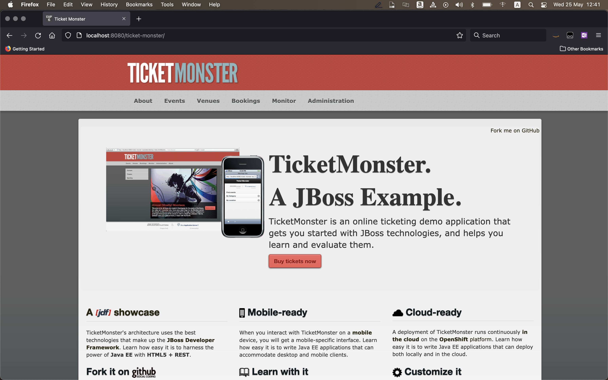

# Introduction
Welcome to the Containers Hackday event!

## Event details

Here is a sequence of tasks to be done as part of this event.

1. [Launch](doc/monolith.md) the monolith application.
2. [Reverse engineer](doc/reverse-engg.md) the monolith application.
3. [Forward engineer](doc/forward-engg.md) the microservices.
4. [Launch UI application](doc/ui.md) with APIs in Step 5 configured.
5. Demo!

## Sample application

To get you started, take a look into the [documentation](samples/README.md) of a sample application. You can develop microservices using this sample application as a base.

## Submission

The submission is expected to be one AWS CodeCommit repository. At the root of this repository, there should be a `README.md` file that describes end-to-end instructions for installation and running the application.

Happy hacking!