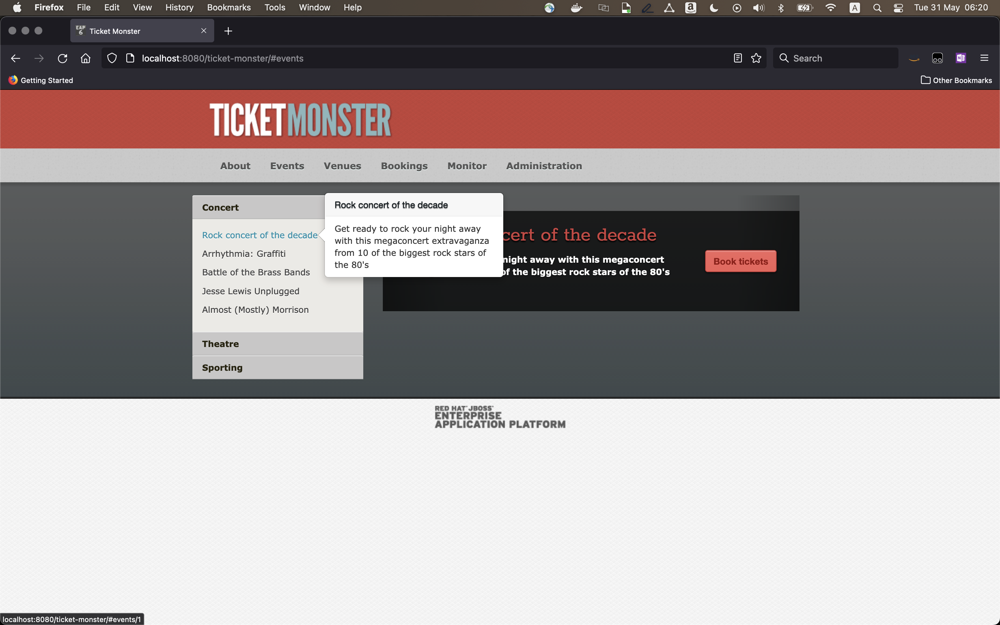
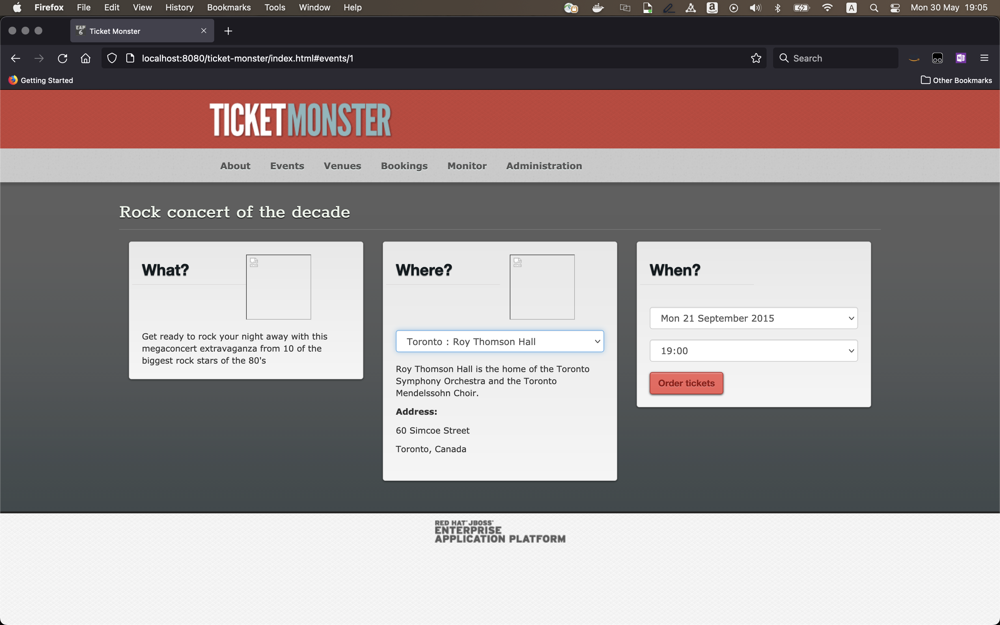
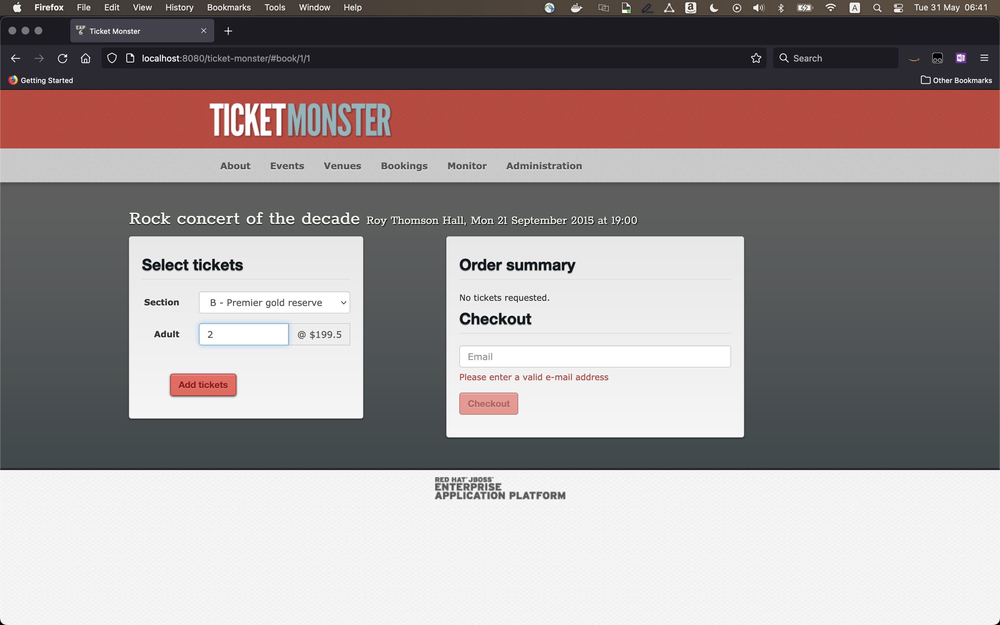
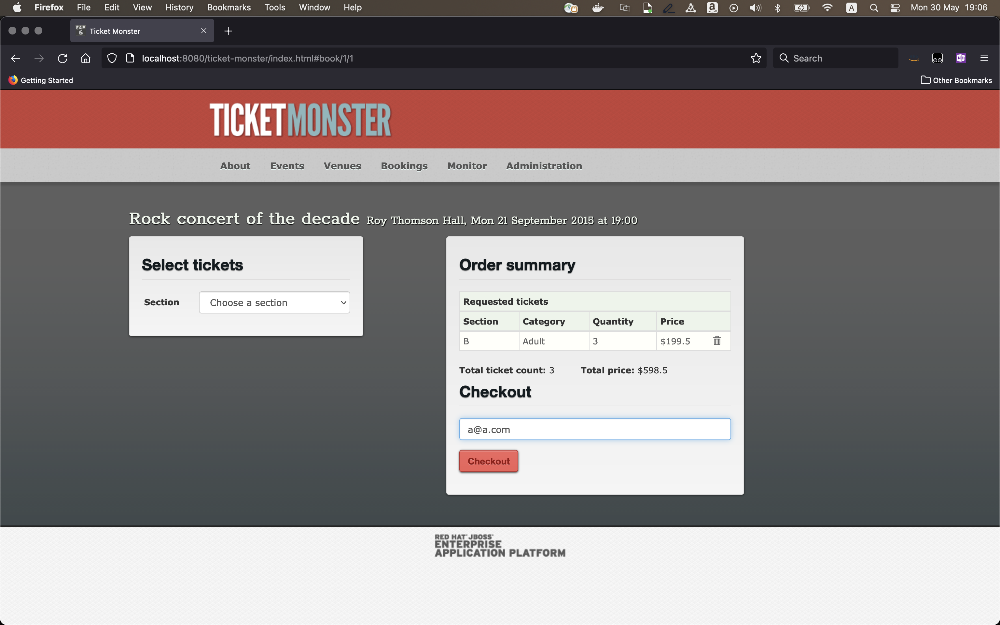
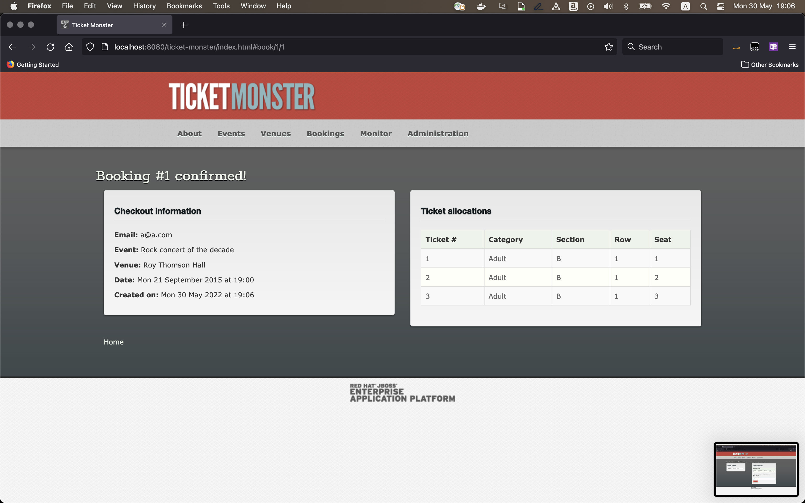
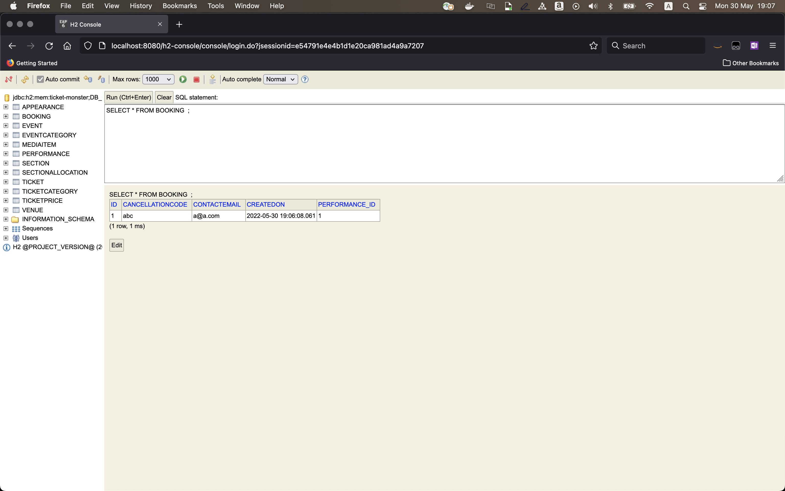
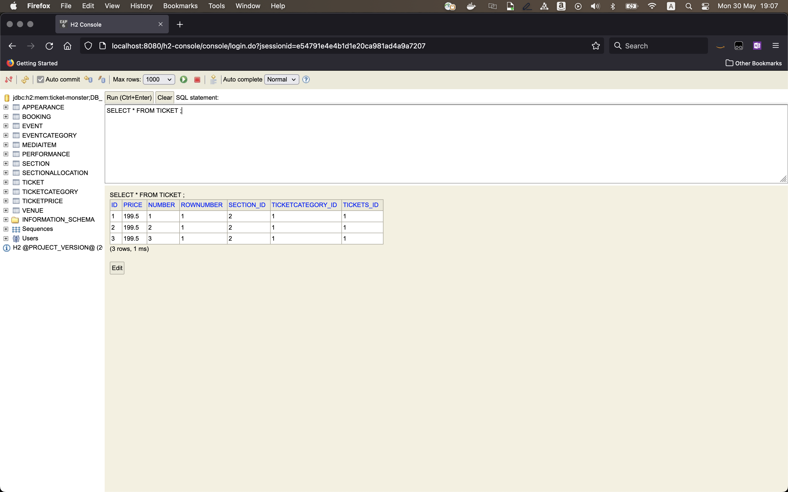

# Introduction
These instructions will launch the [Red Hat Ticket Monster application](https://developers.redhat.com/ticket-monster) as a monolith application on an Amazon EC2 instance running Amazon Linux.

- [Introduction](#introduction)
  - [Pre-requisites](#pre-requisites)
  - [Launch Red Hat Ticket Monster application](#launch-red-hat-ticket-monster-application)
    - [Pre-requisites](#pre-requisites-1)
    - [Install JBoss](#install-jboss)
    - [Build and deploy application](#build-and-deploy-application)
    - [Launch application](#launch-application)
  - [Test drive](#test-drive)
    - [Install `h2-console`](#install-h2-console)
    - [Order tickets](#order-tickets)
    - [Browse database](#browse-database)

## Pre-requisites

1. EC2 instance `m5.large` running Amazon Linux 2 running in `ap-south-1` (Mumbai) region and in a private subnet.
2. An EC2 instance (any OS) in **public** subnet to `ssh` into the Amazon Linux 2 instance.
3. The EC2 instance should be accessible at the following ports.
   1. `22` for `ssh` from the bastion host (See Step 2 above).
   2. `8080` for application from an ALB.
   3. `9090` for administration from an ALB.

Instructions to create the ALB are [here](#create-an-alb).

## Launch Red Hat Ticket Monster application

The following instructions have been tested for

- Amazon Linux 2 instance.
- [Open JDK 8](https://openjdk.java.net/install/)
- [JBoss EAP 6.3.0](https://developers.redhat.com/products/eap/overview?referrer=jbd)

### Pre-requisites

```bash
sudo yum update
sudo yum install -y java-1.8.0-openjdk maven
```

### Install JBoss

```bash
wget https://github.com/nsubrahm-aws/app-mod-j2ee/releases/download/v0.0.0/jboss-eap-6.3.0.zip
unzip jboss-eap-6.3.0.zip
cd jboss-eap-6.3/bin
nohup ./standalone.sh  -b 0.0.0.0 -bmanagement 0.0.0.0 &
```

### Build and deploy application

```bash
cd
wget https://github.com/nsubrahm-aws/app-mod-j2ee/releases/download/v0.0.0/ticket-monster-main.tar.gz
tar -xzvf ticket-monster-main.tar.gz
cd ticket-monster-main/demo
mvn clean package jboss-as:deploy
```

### Launch application

1. Launch application with `http://ec2-dns:8080/ticket-monster`
2. Launch management port with `http://ec2-dns:9990`

## Test drive

### Install `h2-console`

- https://developers.redhat.com/quickstarts/eap-archive/h2-console

1. Download and extract the WAR file to your laptop with the following command.

```bash
wget https://github.com/nsubrahm-aws/app-mod-j2ee/releases/download/v0.0.0/h2-console.zip
unzip h2-console.zip
```

2. Deploy the WAR file using the management console at `http://ec2-dns:9990/`

3. Launch `h2-console` with `http://ec2-dns:8080/h2-console`.

4. Configure the console as follows.
   1. JDBC URL: `jdbc:h2:mem:ticket-monster;DB_CLOSE_ON_EXIT=FALSE;DB_CLOSE_DELAY=-1`
   2. User Name: `sa`
   3. Password: `sa`

5. Click `Test Connection` to verify connection as shown below.


6. Click `Connect` to launch console for H2 database used in Red Hat Ticket Monster application.


### Order tickets

1. Launch the application with `http://ec2-dns:8080/ticket-monster`.
2. Click `Buy tickets` and in the resulting page, click on `Concert` on the left navigation bar.



3. Click `Rock concert of the decade`, select `Toronto : Roy Thomson Hall` as the venue and click `Order tickets`.



4. Select a section from the `Section` drop-down e.g. `B - Premier gold reserve`, enter number of tickets e.g. `3`.



5. Click `Add tickets`.



6. Enter any email address e.g. `a@a.com` and click `Checkout`.



7. Your tickets are booked!

### Browse database

1. Launch the `h2-console` with `http://ec2-dns:8080/h2-console`.
2. Enter password as `sa` and click `Connect`.
3. Enter query as `SELECT * FROM BOOKING;` to list the bookings made.



4. Overwrite previous query with `SELECT * FROM TICKET;` to list tickets of the bookings made. The values in the column `TICKETS_ID` are the same as the `BOOKING_ID` in `BOOKING` table.

